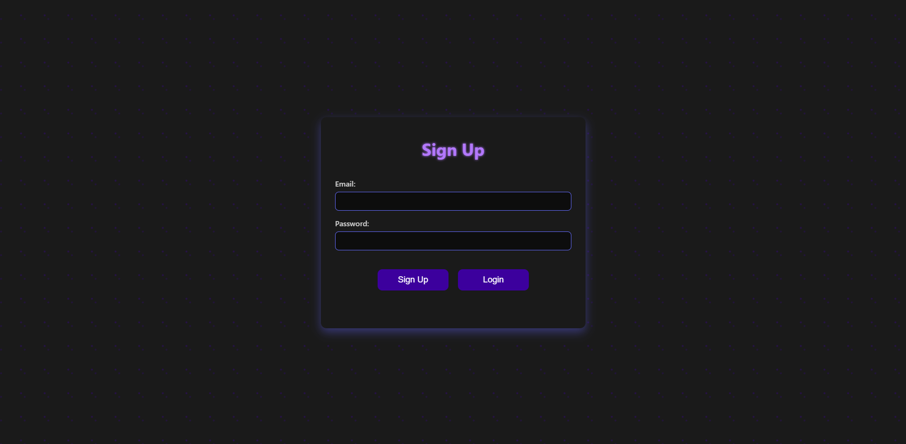
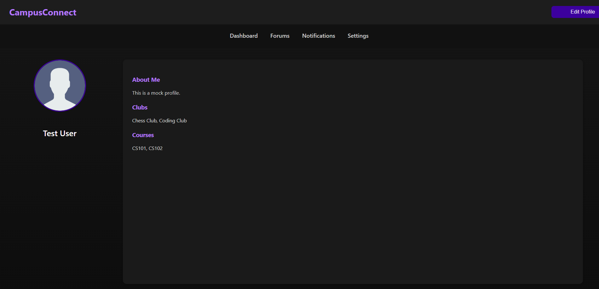
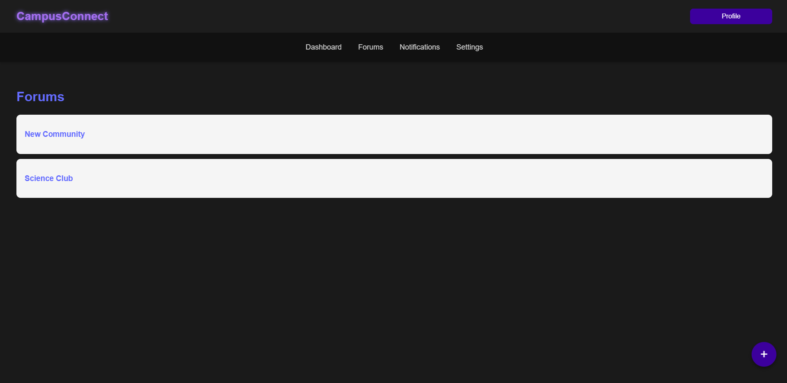

# CampusConnect

**CampusConnect** is a full-stack social platform for college students that allows users to register, create profiles, join clubs, track courses, post in forums, and build reputations within the campus community. Built with **.NET 8**, **Entity Framework Core**, and **React**, it demonstrates modern full-stack development practices, authentication, and relational data management.

---

## **Features**

- **User Authentication**: Secure email/password login with hashed passwords.  
- **Profile Management**: Create and edit a profile linked to your login.  
- **Clubs & Courses**: Users can associate themselves with multiple clubs and courses.  
- **Forum & Posts**: Create threads and posts to engage with other users.  
- **Reputation System**: Users can earn reputation for contributions.  
- **Secure Data Handling**: Sensitive information like passwords are hashed and database credentials are hidden using `.gitignore` and environment variables.

---

## **Tech Stack**

**Backend**:  
- .NET 8 / ASP.NET Core  
- Entity Framework Core  
- SQL Server  

**Frontend**:  
- React  
- Axios for API calls  
- React Router for page navigation  

**Authentication**:  
- ASP.NET Core Identity password hasher  

---

## **Getting Started**

### **Prerequisites**

- [.NET 8 SDK](https://dotnet.microsoft.com/download/dotnet/8.0)  
- [Node.js](https://nodejs.org/)  
- SQL Server instance  

---

### **Backend Setup**

1. **Clone the repository:**

Configure the database connection in appsettings.Development.json (not tracked in Git):

` "ConnectionStrings":{"DefaultConnection": "Server=localhost;Database=CampusConnect;User Id=YOUR_USER;Password=YOUR_PASSWORD;"}`

Apply migrations and create the database:

dotnet ef database update

Run the backend API:

dotnet run

Frontend Setup

Navigate to the frontend folder:

cd ../Frontend

Install dependencies:

npm install

Run the React app:

npm run dev

## **Usage**

Sign Up: Create a new account with email and password.

Profile Creation: Automatically linked to your login; fill in username, major, year, clubs, and courses.

Dashboard: Access posts, threads, and other user profiles.

Edit Profile: Update your information anytime.

## Screenshots / Demo

### 🔹 Login Page

### 🔹 Profile Page

### 🔹 Forums

## **Project Structure**
CampusConnect/

─ CampusConnectAPI/      # .NET backend

─ Frontend/             # React frontend

─ SQL/                  # Database scripts

─ docs/                 # Optional documentation & diagrams

─ .gitignore

─ README.md

## **Security**

Passwords are hashed using ASP.NET Core Identity.

Database credentials are hidden from GitHub using .gitignore and environment variables.

No sensitive data is exposed to the frontend.

Contributing

Fork the repository.

**Create a branch:**

git checkout -b feature/my-feature

**Commit your changes:**

git commit -am "Add some feature"

**Push to the branch:**

git push origin feature/my-feature

Open a pull request.

**License**

This project is licensed under the MIT License.

## **What I learned**

React,

How to connect the frontend to the API,

GET and PUSH usage,

Rate limiting and protecting the API,

Connecting the database to the API

## **Contact**

Cory Wolf

GitHub: github.com/CoryWolf55

Email: your-email@example.com
